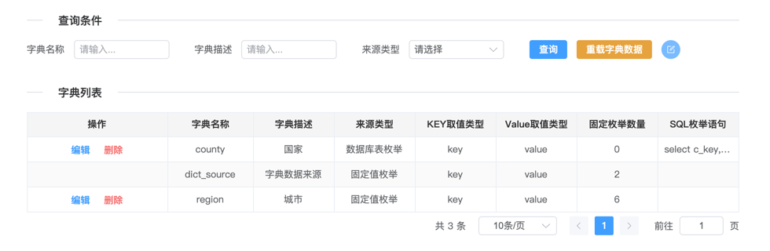
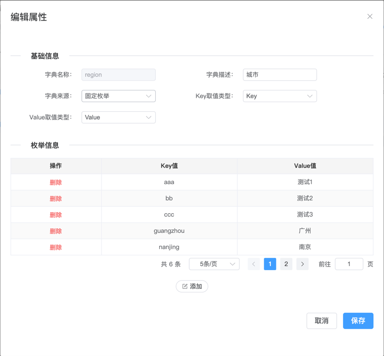
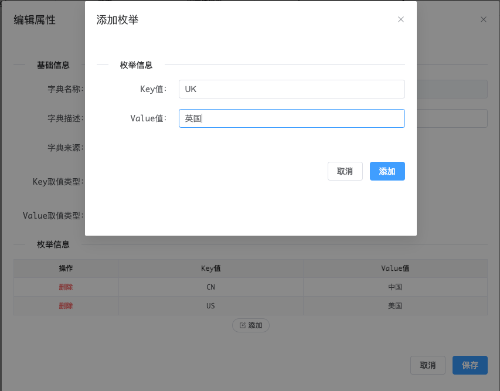
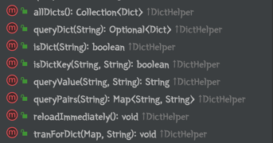
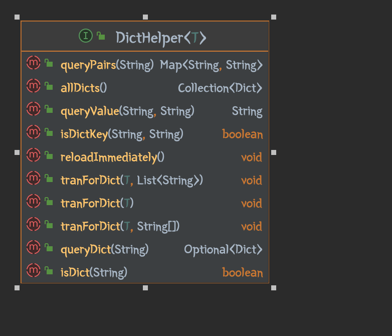

# 功能说明

- 字典管理功能，提供控制台功能
- 是一个依赖包，依赖后应用启动后会字典数据加载到内存中
- 支持对字典的转义api，支持map、普通java对象，以及部分其他api


# 1.安装

```bash
git clone https://github.com/hbq969/h-dict.git
cd h-dict/src/main/resources/static
nvm use 20
npm run build
cd h-dict/
mvn -U package install
```


# 2.配置

1. 依赖

```xml
<dependency>
  <groupId>com.github.hbq969</groupId>
  <artifactId>h-dict</artifactId>
  <version>1.0-SNAPSHOT</version>
</dependency>
```


2. 配置

​		h2数据库

```yaml
# 数据源配置（省略）
...

# mybatis配置
mybatis:
  # 数据库类型，支持 embedded/mysql/oracle
	dialog: embedded
	# 追加一下内容（如果原有内容存在）
  mapper-locations: 
    - classpath*:**/mapper/common/*Mapper.xml
    - classpath*:**/mapper/${mybatis.dialog}/*Mapper.xml
  
# 添加字典管理控制台页面
spring:
  mvc:
    resource-handler-registry:
      entries:
        - handlers: /ui-dict/**
          locations: classpath:/static/ui-dict/

# 开启字典管理
dict:
  enabled: true
  # dic控制台接口访问token头
  dictToken: hbq969@gmail.com
  # map转义时转义后字段的前缀
  map-key-prefix: hbq
  # 缓存字典数据重载周期
  reload:
    cron: 0,30 * * * * *
```


# 3.管理界面

http://ip:port/[${server.servlet.context-path}]/ui-dict/index.html


1. 查询列表




2. 新增字典







3. 新增固定枚举值




# 4.使用

- api接口说明




- 针对map转义

```yaml
# 开启字典管理
dict:
  enabled: true
  # map转义时转义后字段的前缀
  map-key-prefix: fmt
```

```java
import com.github.hbq969.code.dict.service.api.impl.MapDictHelperImpl;

@Autowired
private MapDictHelperImpl mapDic;

@Autowired
private ListMapDictHelperImpl listDic;
```

```java
Map<String,Object> map = new HashMap<>();
map.put('region','suzhou');
mapDic.tranForDict(map);

List<Map> list = new ArrayList<>();
list.add(map);
listDic.tranForDict(list);

// 转义后map
{'region':'suzhou','fmtRegion':'苏州'}
```


- java对象转义

```java
import com.github.hbq969.code.dict.service.api.impl.ModelDictHelperImpl;

@Autowired
private ModelDictHelperImpl modelDic;

@Autowired
private ListModelDictHelperImpl listDic;
```

```java
@Data
Class Foo{
  @Td(fmtFieldName="fmtRegion")
	private String region;
	private String fmtRegion;
}

Foo foo = new Foo();
foo.setRegion('suzhou');
modelDic.tranForDict(foo);

List<Foo> list = new ArrayList<>();
list.add(foo);
listDic.tranForDict(list);

// 转义后
foo.getFmtRegion()=> '苏州'
```

